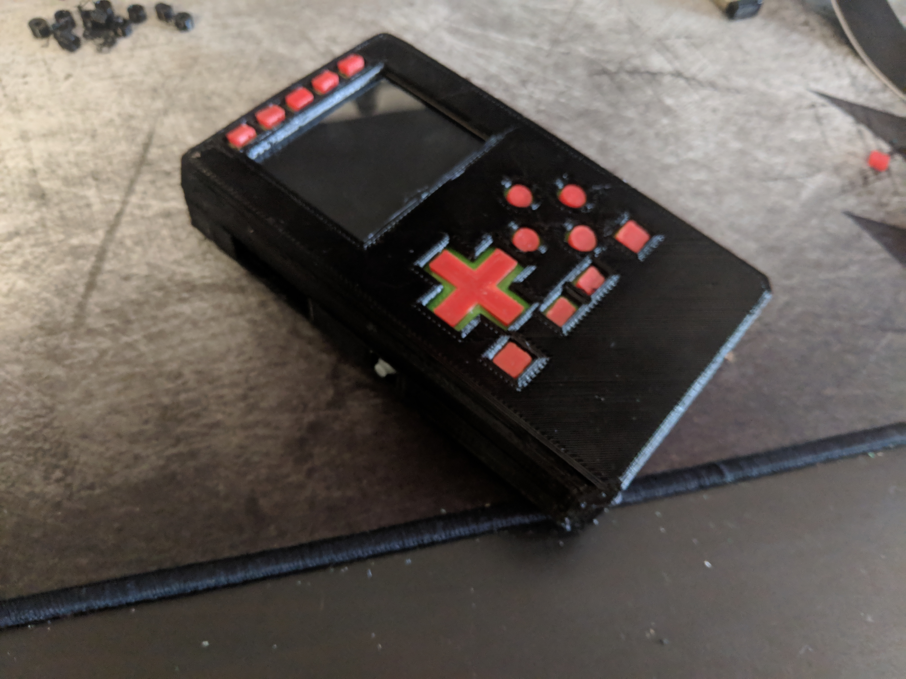

# Portable Handheld

Portable retropie system inspired by the pocket pigrrl

## Prototype V0.9

## TODO

- add photos of printed prototype to github!
- come up with a good name
- make a BoM
- address fixes for model listed in `main.scad`
- automate building stl's for individual parts of model
- polish and share software setup scripts
- put on thingiverse

## Design Goals
- must fit in pocket
- must be sturdy
- see how well printing buttons with flexible plastic connecting to case
  - reduces part count when printed on a multi-material printer, and might not be terrible?
- expose audio and hdmi on side of case
- must be modular and easy to replace parts

## Printing Instructions
- prototype STLs are available in the v0.9 folder (v1 is pending some improvements listed in `main.scad`)
- needs to be printed in 2 halves, a front half and back half.
  - no supports needed!

- print 12 `washer_4mm.stl` (color does not matter, these are internal) if using `4-40 x 3/8"` screws (these were the screws I had on hand, and were recommended for the pigrrl 2
)
### Multi Material Instructions

Front half is one print and back half is the second print

- Front Half
  - load front_case.amf
  - flip upside down! (doh)
  - front_case.stl preferably in PETG or PLA (ABS is likely to warp)
  - front_buttons.stl in any non-flexible plastic (preferably colorful!)
  - front_flex.stl in flexible plastic
- Back Half
  - load back_case.amf
  - back_case.stl preferably in PETG or PLA (ABS is likely to warp)
  - MM_back_buttons.stl in any non-flexible plastic (preferably colorful!)
  - MM_LR_flex.stl in flexible plastic

### Single Material Instructions

Make sure your printer is calibrated well! https://www.thingiverse.com/thing:533472/files I recommend the negative space tolerance test.

- PETG/PLA preferable:
  - front_case.stl
    - flip upside down!
  - back_case.stl
- any non-flexible plastic:
  - LR_button.stl 2x
  - front_buttons.stl
- flexible plastic
  - LR_flex.stl 2x
  - front_flex.stl

  print all the parts, glue the buttons into the holes on the flexible parts, and then glue the flexible parts to the case.

## Parts

parts list comes to about $120 of hardware from Adafruit, including the battery, sd card and pi.

- TODO this list is not complete
- [Raspberry pi 3 A+](https://www.adafruit.com/product/4027)
- [Adafruit PITFT 2.4" touchscreen](https://www.adafruit.com/product/2455)
- [26-pin cable](https://www.adafruit.com/product/862)
- [powerboost 1000c](https://www.adafruit.com/product/2465)
  - no substitutes!
  - [decent power supply](https://www.adafruit.com/product/1995)
- perfboard
- [#4-40 3/8 screws](https://www.amazon.com/Machine-Screws-Phillips-Stainless-Quantity/dp/B01LY5VW6Q)
  - possibly substitute with `M3` and modify screws in `main.scad`
  - depending on length, printed washer_4mm may not be needed
- [slim tactile buttons](https://www.adafruit.com/product/1489) for PITFT
- [soft tactile buttons](https://www.adafruit.com/product/3101)
  - can substitute with (clicky switches)[https://www.adafruit.com/product/367]
- wires
- sd card, one big enough for all your games!
- [slide switch](https://www.adafruit.com/product/805)
- [3.7v 200mAh battery](https://www.adafruit.com/product/2011)